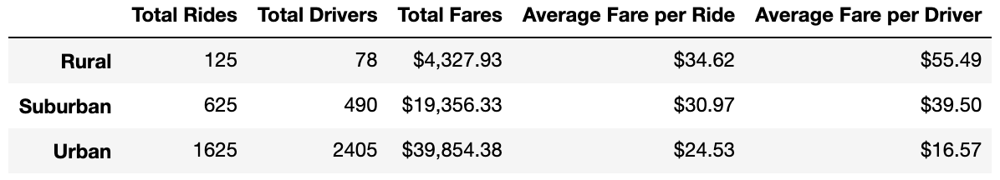

# 5PyBer_Analysis
Visualizing ride sharing data

## Project Overview
The purpse of this project was to visualize ride sharing data using Pandas and Matplotlib. I was given the task of creating a dataframe that summarized the ride-share data based on the different city types. After that, I created a line graph that represents the total weekly fares for every city type.

## Result
The most glaring result found in the "pyber_summary_df" was that there is so much more money made in urban areas vs. rural areas. This seems like a conclusion that could've been made before any analysis but I dont think many people woudlve guessed that its almost ten times as much! 

## Summary
Disparities and recommendations
1. a) Urban drivers are paid the least while having the greatest total ride fare. 
   b)In order to combat this trend I believe Pyber should re-evuluate how much Pyber executive make in order to pay their        drivers or possibly look into changing the the price of urban rides.
2. a) In rural areas, the average cost per ride in rural areas is more than it is in any other in city type.
   b) Pyber should find a way to employ more drivers in rural ares so that the prices could decrease. This will also provide       more rides to rural customers
   
