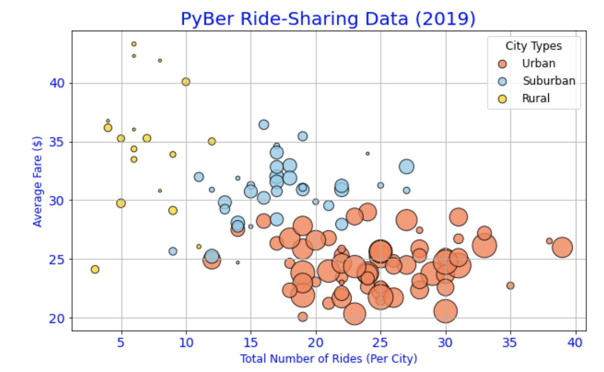
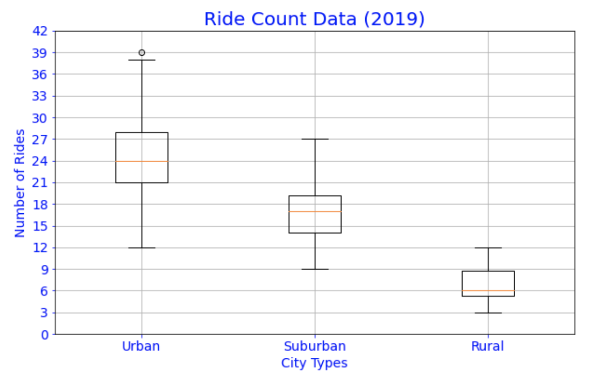
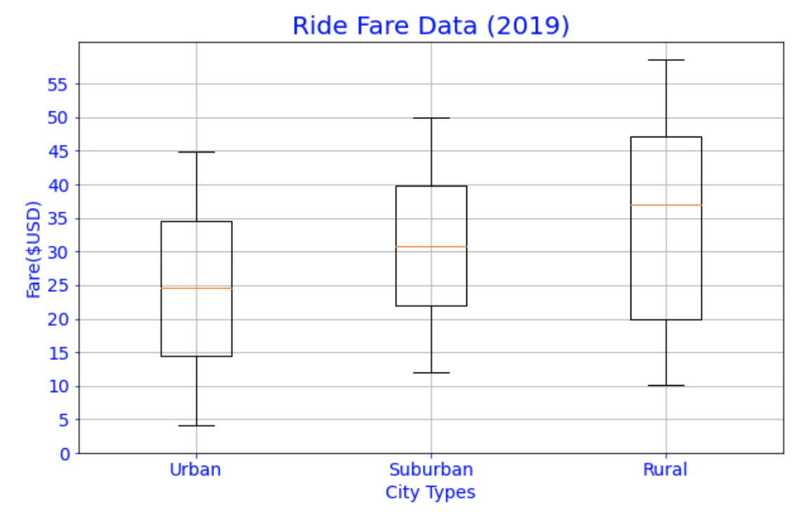
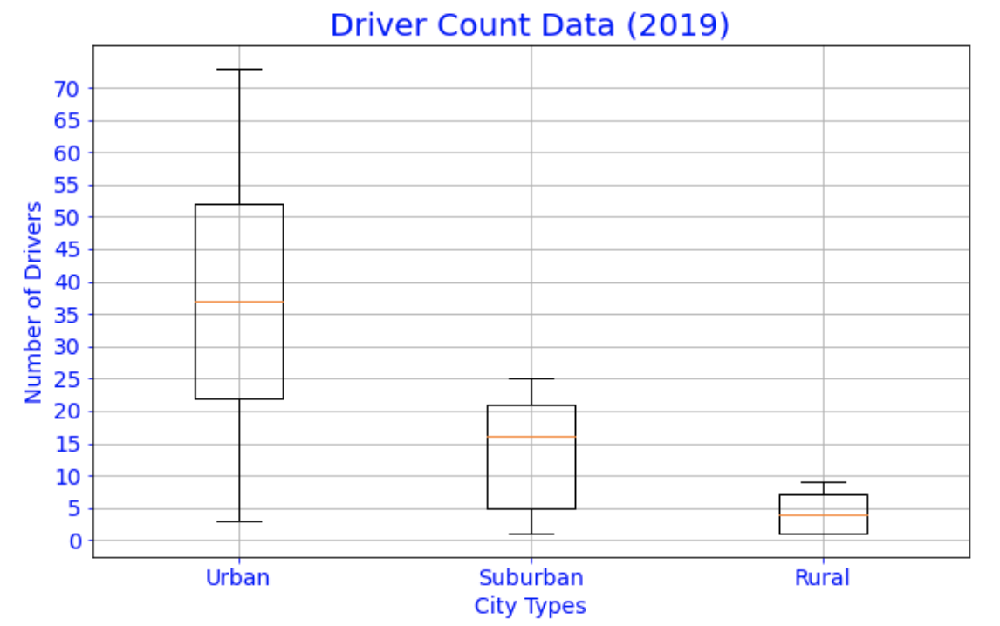
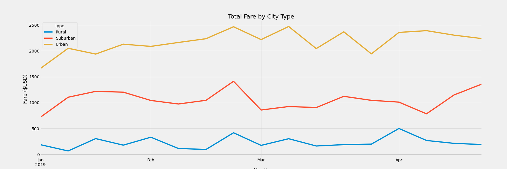

# PyBer_Analysis
## Overview
This analysis seeks to provide insights into ride accessibility and affordability for PyBer, a Python-based ride-sharing app company. Our goal is to perform exploratory data analysis on a large dataset to determine the relationship between the type of city, the number of drivers and riders, and the percentage of total fares, riders, and drivers by type of city. To achieve this goal, We would create several visualizations, write python scripts using pandas library and Matplotlib to create various charts. In the end, we hope to use the analysis and visualizations we produce to improve access to ride-sharing services and determine affordability for underserved neighborhoods.

After creating initial results, our analysis moves to a second phase where we make a summary DataFrame of the ride-sharing data by city type. Then, using Pandas and Matplotlib, we would create a multiple-line graph that shows the total weekly fares for each city type. Finally, we would summarize how the data differs by city type and how decision-makers can use those differences at PyBer to answer questions around ride accessibility and affordability.

### Control Flow
1. Import your data into a Pandas DataFrame.
2. Inspect the data to dertermine the shape of the data, what types of columns are present, and if the data is readable or needs to be converted in some way.
3. Merge your DataFrames.
4. Create a bubble chart that showcases the average fare versus the total number of rides with bubble size based on the total number of drivers for each city type, including urban, suburban, and rural.
5. Determine the mean, median, and mode for the following:
    - The total number of rides for each city type.
    - The average fares for each city type.
    - The total number of drivers for each city type.
6. Create box-and-whisker plots that visualize each of the following to determine if there are any outliers:
    - The number of rides for each city type.
    - The fares for each city type.
    - The number of drivers for each city type.
7. Create a pie chart that visualizes each of the following data for each city type:
    - The percent of total fares.
    - The percent of total rides.
    - The percent of total drivers.

### Intial Findings
1. A visual inspection of our bubble chart reveal that urban cities have the highest driver count and total number of rides. Conversely, rural cities with the lowest number of rides and smallest driver count have the highest fares.

    Note: Circle size correlates with driver count per city

3. Our Summary Statistics for Number of Rides by City Type show that If we compare the average number of rides between each city type, we'll notice that the average number of rides in the rural cities is about 4 and 3.5 times lower than urban and suburban cities, respectively.
4. Our Box and Whisker plot analysis reveals that There is one outlier in the urban ride count data. Also, the average number of rides in the rural cities is about 4- and 3.5-times lower per city than the urban and suburban cities, respectively.
5. From our combined Ride fare data box-and-whisker plots, we see that there are no outliers. However, the average fare for rides in the rural cities is about $11 and $5 more per ride than the urban and suburban cities, respectively. Why do you think there is such a big difference? The number of drivers in rural cities helps explain tis huge difference in fares, there are less number of drivers compared to riders. Rural cities have a mean of 4 drivers and mean ride count of 7 {ratio 1:2} Urban cities have mean 24 ride count and mean 36 {ratio 2:3}; Suburban mean driver 14 and mean ride count 17 {ratio 4:5} Looking at the number of riders, we can suggest that Urban cities have the highest revenue.
6. From our combined Driver Count data box-and-whisker plots The average number of drivers in rural cities is nine to four times less per city than in urban and suburban cities, respectively. By looking at the driver count data and fare data, can you get a sense of the overall revenue?

Ride-Sharing Summary DataFrame

Using the object-oriented interface method and the df.plot() method, as well as the Matplotlib "fivethirtyeight" graph style, we graphed the resampled DataFrame from the previous result to obtain to fares for the weekly bins in the following graph.

Line Chart Showing Total Fares by City Type

## Summary

1. One area to pay attention to is the rural cities where the mean ratio of drivers to riders is 1 to 2. PyBer needs to further investigate why there is a low driver count compared to number of rides. Research questions that could be asked include:
   - are rural distances typically longer in rural cities than in urban cities
   - are all rural cities accurately captured on maps
   - what is the actual market demand for PyBer in rural cities
   - are there really enough people requesting rides in rural cities
   - is internet connectivity an impediment to PyBer reach in rural cities
   - if PyBers mode of payment is credit card, does the rural population have credits cards or do they rely on cash to carry out their daily transactions.

2. Another recommendation is to find the sweet spot between average fare per ride (cost to the rider) and average fare per driver (revenue to the driver). A way to achieve the optimal solution to the optimization problem is to maintain a minimum threshold of driver count across all city types while increasing the number of riders. An increasing number of riders would reduce mean fares and lead to a multiplier effect on ride count. Similarly, maintaining a driver count threshold across different city types could result in fare per driver upper and lower boundaries that are not too far apart.

3. While the Average fare per driver is highest for rural cities ($55.49) with a mean ride count of 7, that amount pales compared to the $16 and average round count of 24 in urban cities. A potential research question for PyBer could be:
   - can a subscription model be introduced for riders in rural cities where there is flat fee structure for a specified period
   - can drivers be incentivized to drive in rural cities

    Answers to questions like these can help illuminate the disparities between the fares and driver count in rural and urban cities and provide concrete steps to making rides  affordable and accessible across all city types.
